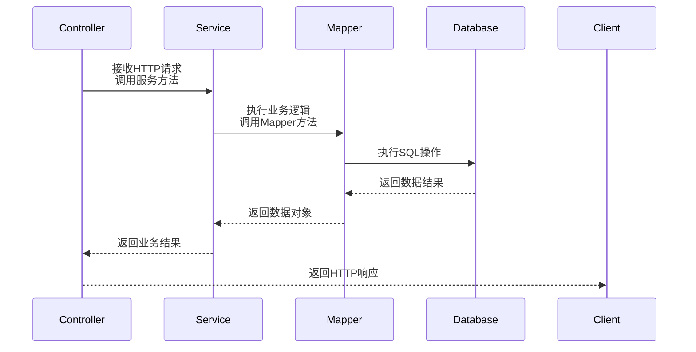

# FusionBase 项目文档

## 项目概述
FusionBase 是一个基于 Spring Boot 和 Vue.js 的全栈相册管理系统，提供用户管理、相册上传、照片管理等功能。项目采用分层架构设计，实现了前后端分离和 RESTful API 接口。


## 技术栈

### 后端技术
- **核心框架**: Spring Boot 2.7.x
- **安全框架**: Spring Security + JWT
- **数据访问**: MyBatis + MySQL
- **缓存**: Redis
- **对象存储**: MinIO
- **API文档**: Knife4j (Swagger增强)
- **构建工具**: Maven

### 前端技术
- **框架**: Vue.js 3.x
- **状态管理**: Vuex
- **路由**: Vue Router
- **UI库**: Element Plus
- **HTTP库**: Axios

### 数据库
MySQL 8.0+ (使用 utf8mb4 字符集)

## 项目结构
```
FusionBase/
├── 基础文件
│   ├── create_database.sql    # 数据库初始化脚本
│   ├── create_fusionbase.bat  # 项目启动脚本
│   ├── pom.xml                # 父工程依赖配置
│   └── readme.md              # 项目说明文档
│
├── .idea/                     # IDEA 项目配置文件
├── logs/                      # 日志文件存储目录
│   └── FusionBase/
│       └── application.log    # 系统运行日志
│
├── common/                    # 通用模块（公共工具、配置）
│   ├── pom.xml
│   └── src/main/java/com/yu/fusionbase/common
│       ├── constant/          # 常量定义（如 Redis 键名）
│       ├── exception/         # 异常处理（全局异常处理器、自定义异常）
│       ├── minio/             # MinIO 配置（连接参数、客户端配置）
│       ├── mybatisplus/       # MyBatis-Plus 配置（自动填充、插件）
│       ├── redis/             # Redis 配置（序列化、连接池）
│       ├── result/            # 统一响应结果封装（Result、状态码枚举）
│       └── utils/             # 工具类（JWT 工具、日志工具）
│
├── model/                     # 数据模型模块（实体类、枚举）
│   ├── pom.xml
│   └── src/main/java/com/yu/fusionbase/model
│       ├── entity/            # 数据库实体类（对应表结构）
│       │   ├── ActivityLog    # 操作日志实体
│       │   ├── Album          # 相册实体
│       │   ├── AlbumShare     # 相册共享实体
│       │   ├── Media          # 媒体文件实体
│       │   ├── User           # 用户实体
│       │   └── BaseEntity     # 实体基类（包含公共字段如 ID、时间戳）
│       └── enums/             # 枚举类（文件类型、邀请状态等）
│
└── web/                       # Web 应用模块（接口、控制器）
    ├── web-admin/             # 管理员端接口
    │   ├── pom.xml
    │   └── src/main
    │       ├── java/          # 后端代码（控制器、服务等）
    │       └── resources/     # 配置文件（应用配置、日志配置）
    │
    └── web-user/              # 用户端接口
        ├── pom.xml
        └── src/main
            ├── java/com/yu/fusionbase/web/user
            │   ├── controller/ # 接口控制器（登录、相册管理等）
            │   ├── service/    # 业务逻辑层
            │   ├── mapper/     # 数据访问层（MyBatis 映射）
            │   ├── vo/         # 前端展示数据模型（如登录响应 VO）
            │   ├── custom/     # 自定义配置（拦截器、Swagger 配置）
            │   └── ScheduleTasks/ # 定时任务
            └── resources/      # 配置文件
                ├── application.yml # 应用配置（端口、数据库连接等）
                ├── logback.xml     # 日志配置
                └── mapper/         # MyBatis 映射文件
```

## 核心功能

### 1. 用户管理
- 用户注册与登录
- JWT令牌认证
- 用户信息管理
- 权限控制(管理员/普通用户)
- 用户软删除

### 2. 相册管理
- 照片/视频上传
- 文件元数据存储
- 缩略图生成
- 相册浏览
- 相册更新与删除

### 3. 文件存储
- MinIO分布式对象存储
- 文件分块上传
- 文件访问控制
- 存储桶管理

## 数据库设计

## 核心组件职责

### 后端分层架构

| 组件类型 | 位置 | 职责 |
|----------|------|------|
| **Mapper** | `mapper/` | 数据访问接口，定义数据库操作方法 |
| **Service** | `service/` | 业务逻辑接口，定义业务操作契约 |
| **ServiceImpl** | `service/impl/` | 业务逻辑实现，包含核心业务处理 |
| **XML** | `resources/mapper/` | MyBatis SQL映射文件，实现复杂查询 |
| **Controller** | `controller/` | REST API端点，处理HTTP请求 |
| **Entity** | `entity/` | 数据库表映射对象 |
| **DTO** | `dto/` | 数据传输对象，API请求/响应模型 |

### 工作流程


## API文档

访问地址：`http://localhost:8080/doc.html`

### 用户管理API
| 端点 | 方法 | 描述 |
|------|------|------|
| `/api/users/register` | POST | 用户注册 |
| `/api/users/login` | POST | 用户登录 |
| `/api/users/{userId}` | GET | 获取用户信息 |
| `/api/users` | GET | 获取所有用户 |
| `/api/users/{userId}` | PUT | 更新用户信息 |
| `/api/users/{userId}` | DELETE | 删除用户 |

### 相册管理API
| 端点 | 方法 | 描述 |
|------|------|------|
| `/api/albums/upload` | POST | 上传相册 |
| `/api/albums/{albumId}` | GET | 获取相册详情 |
| `/api/albums` | GET | 获取所有相册 |
| `/api/albums/my-albums` | GET | 获取当前用户相册 |
| `/api/albums/{albumId}` | PUT | 更新相册信息 |
| `/api/albums/{albumId}` | DELETE | 删除相册 |

## 部署指南

### 后端部署
###
1. 创建MySQL数据库：
   ```bash
   docker run -d --name mysql -p 3306:3306 -e "MYSQL_ROOT_PASSWORD=root" -v mysql-data:/var/lib/mysql mysql:latest
   ```
2. 配置Redis服务:
   ```bash
   docker run -d --name redis -p 6379:6379 -v redis-data:/data redis:latest redis-server --requirepass "fusionBase"
   ```
3. 配置MinIO对象存储:
   ```bash
   docker run -d --name minio -p 9000:9000 -p 9090:9090 -e "MINIO_ROOT_USER=admin" -e "MINIO_ROOT_PASSWORD=admin123" quay.io/minio/minio:RELEASE.2025-04-22T22-12-26Z server /data --console-address ":9090"
   ```
4. 修改`application.yml`中的配置
5. 构建项目：
   ```bash
   cd backend
   mvn clean package
   ```
6. 运行项目：
   ```bash
   java -jar target/fusionbase-backend-1.0.0.jar
   ```

### 前端部署
1. 安装依赖：
   ```bash
   cd frontend
   npm install
   ```
2. 配置API基础URL（修改`.env`文件）
3. 启动开发服务器：
   ```bash
   npm run serve
   ```
4. 构建生产版本：
   ```bash
   npm run build
   ```

### Docker部署
```bash
# 构建后端镜像
docker build -t fusionbase-backend backend/

# 构建前端镜像
docker build -t fusionbase-frontend frontend/

# 启动服务
docker-compose up -d
```

## 开发指南

### 后端开发
1. 实体类更新：
    - 修改`entity/`中的类
    - 更新对应的Mapper接口
2. 添加新API：
    - 在`controller/`创建新控制器
    - 在`service/`和`service/impl/`中添加业务逻辑
    - 在`mapper/`中添加数据访问方法
3. 添加API文档：
    - 使用Swagger注解描述API
    - 访问`/doc.html`验证文档

### 前端开发
1. 添加新页面：
    - 在`views/`创建Vue组件
    - 在`router/index.js`中添加路由
2. 调用API：
    - 在`api/`中创建API封装
    - 在Vue组件中使用`this.$axios`调用API
3. 状态管理：
    - 在`store/modules/`中创建Vuex模块
    - 在组件中使用`mapState`/`mapActions`

## 常见问题解决

### 数据库连接问题
1. 检查`application.yml`中的数据库配置
2. 确保MySQL服务正在运行
3. 验证数据库用户权限

### JWT认证失败
1. 检查请求头中的`Authorization: Bearer <token>`
2. 验证JWT密钥配置（`jwt.secret`）
3. 检查令牌过期时间

### 文件上传失败
1. 验证MinIO服务状态
2. 检查存储桶权限配置
3. 确认文件大小不超过配置限制

## 贡献指南
1. Fork项目仓库
2. 创建特性分支 (`git checkout -b feature/your-feature`)
3. 提交更改 (`git commit -am 'Add some feature'`)
4. 推送到分支 (`git push origin feature/your-feature`)
5. 创建Pull Request

## 许可证
本项目采用 [MIT License](LICENSE)